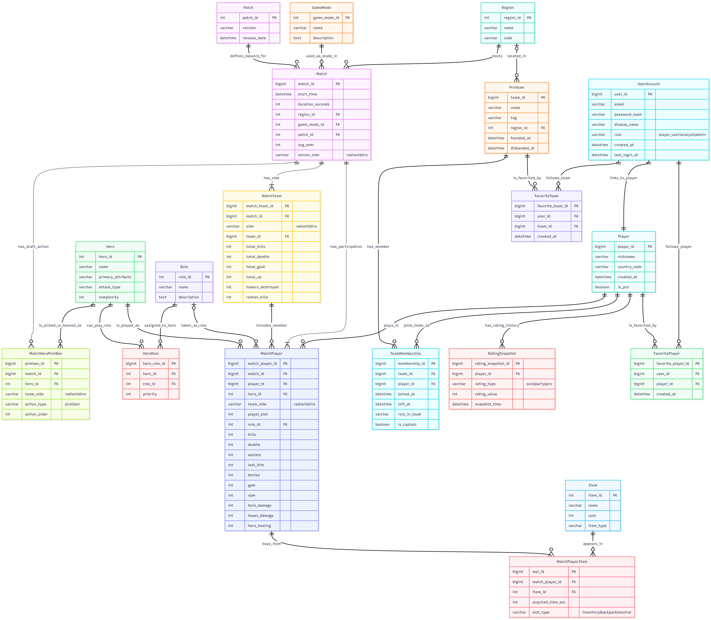

# Dota 2 Statistics Database

Учебный проект по дисциплине «Основы баз данных» (НИУ ВШЭ, майнор «Интеллектуальный анализ данных»). Реляционная база данных на PostgreSQL предназначена для хранения и анализа статистики матчей Dota 2: данных об игроках и командах, результатах матчей, героях, драфтах, предметах и рейтингах.

## Что реализовано

- 20 таблиц и пользовательские `ENUM`-типы; схема нормализована до 3НФ/BCNF
- Первичные и внешние ключи, ограничения уникальности и правила удаления
- SQL-функции для получения данных о матчах и героях, истории матчей игрока и расчёта винрейтов
- Логирование операций `INSERT`, `UPDATE` и `DELETE` с помощью триггеров
- Разграничение доступа между ролями `admin`, `analyst` и `player`
- Демонстрационный набор данных: 100 игроков, 50 героев, 12 команд и 5 матчей

## ER-диаграмма базы данных

## Структура репозитория

- [`create_tables.sql`](./create_tables.sql) — типы, таблицы, ограничения, триггеры и роли
- [`seed_data.sql`](./seed_data.sql) — демонстрационные данные
- [`select_functions.sql`](./select_functions.sql) — аналитические функции и примеры запросов

## Документация

Полную документацию можно прочитать в PDF [`Описание_к_проекту_ИАД.pdf`](./Описание_к_проекту_ИАД.pdf) или [в Overleaf](https://ru.overleaf.com/read/vnzpjdhjvnmn#24541e).